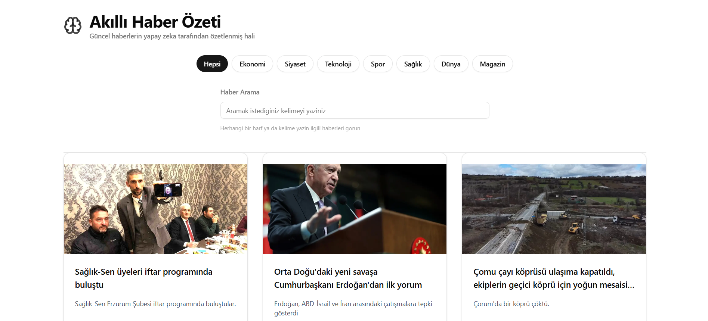
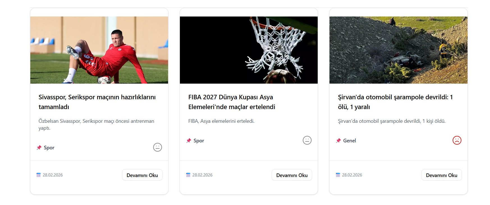
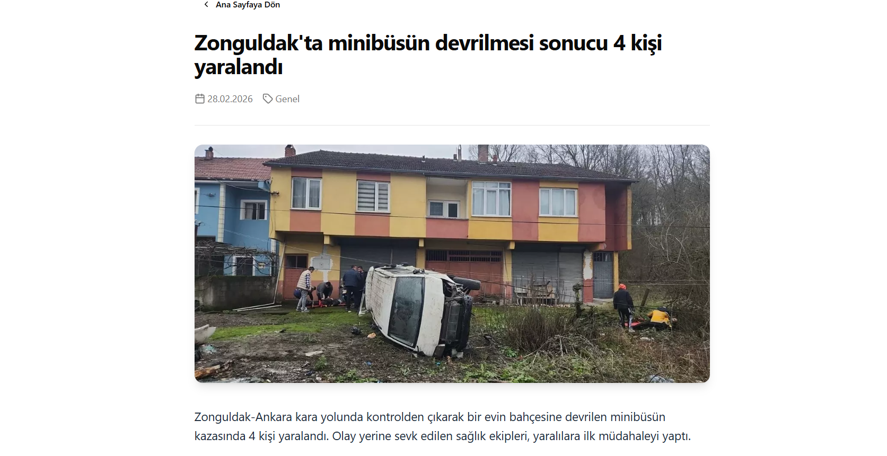
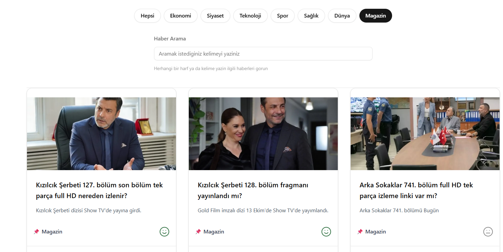

# NewsAI – Summarize, Categorize & Analyze

> A full-stack web application that fetches live news from RSS feeds and uses AI (Llama 3.3 via Groq) to automatically summarize, categorize, and analyze the sentiment of each article.

🔗 **Live Demo:** [ai-news-dashboard-1.onrender.com](https://ai-news-dashboard-1.onrender.com)

---

## 📸 Screenshots

### News Dashboard


### News Card – Sentiment


### Detail


### Category


---

## 💡 Why I Built This

Keeping up with the news is overwhelming. This project tackles that by using AI to do the heavy lifting — every article is automatically condensed into a 35-word summary, assigned a category, and given a sentiment label so you can understand the tone at a glance.

This is also a personal learning project where I practiced building a production-like full-stack app from scratch using Node.js, MongoDB, and React.

---

## ✨ Features

- **AI Summaries** — Each article is summarized in ~35 words using Llama 3.3 (via Groq API)
- **Auto Categorization** — Articles are grouped into categories like Technology, Politics, Sports, etc.
- **Sentiment Analysis** — Visual badges indicate whether the tone is Positive, Negative, or Neutral
- **Search** — Real-time keyword search across all articles
- **Category Filter** — Filter news by topic with a single click
- **Pagination** — Browsing is split into pages for better performance
- **Responsive Design** — Works on both mobile and desktop

---

## 🛠️ Tech Stack

| Layer | Technology |
|---|---|
| Frontend | React.js, Tailwind CSS, Shadcn/UI |
| Backend | Node.js, Express.js |
| Database | MongoDB, Mongoose |
| AI Engine | Groq SDK (Llama-3.3-70b-versatile) |
| News Source | RSS Parser, Node-cron |
| HTTP Client | Axios |

---

## 📂 Project Structure

```
newsai/
├── backend/
│   └── src/
│       ├── config/         # Database connection
│       ├── controllers/    # Route logic & pagination
│       ├── middlewares/    # Error handling
│       ├── models/         # Mongoose schemas
│       ├── routes/         # API endpoints
│       └── services/       # AI integration & RSS parsing
├── frontend/
│   └── src/
│       ├── components/     # Reusable UI components
│       └── pages/          # NewsList, NewsDetail
```

---

## ⚙️ Getting Started

### Prerequisites
- Node.js v18+
- MongoDB (local or Atlas)
- Groq API Key → [console.groq.com](https://console.groq.com)

### Installation

```bash
# 1. Clone the repo
git clone https://github.com/EmirBaranKadirhan/ai-news-dashboard.git
cd ai-news-dashboard

# 2. Install backend dependencies
cd backend && npm install

# 3. Install frontend dependencies
cd ../frontend && npm install
```

### Environment Variables

Create a `.env` file inside the `backend/` folder:

```env
PORT=5000
MONGO_URI=your_mongodb_connection_string
GROQ_API_KEY=your_groq_api_key
```

### Run the App

```bash
# Start backend
cd backend && npm start

# Start frontend (new terminal)
cd frontend && npm run dev
```

App will be running at `http://localhost:5173`

---

## 🔐 Technical Highlights

- **Rate Limiting** — Express rate limiter protects the API from abuse
- **Centralized Error Handling** — A single middleware catches all errors so the app never crashes unexpectedly
- **AI Output Normalization** — Raw AI responses are sanitized and mapped to consistent labels before being saved to the database
- **Debounced Search** — Search input waits for the user to stop typing before making a request, reducing unnecessary API calls

---

## 🌱 What I Learned

- How to design and consume a RESTful API end-to-end
- Integrating third-party AI APIs and handling inconsistent outputs
- Implementing pagination, filtering, and search on both frontend and backend
- Building reusable React components with clean props structure

---

## 📬 Contact

Feel free to reach out or connect!

- GitHub: [@EmirBaranKadirhan](https://github.com/EmirBaranKadirhan)
- LinkedIn: [Emir Baran Kadirhan](https://www.linkedin.com/in/emirkadirhan/)


